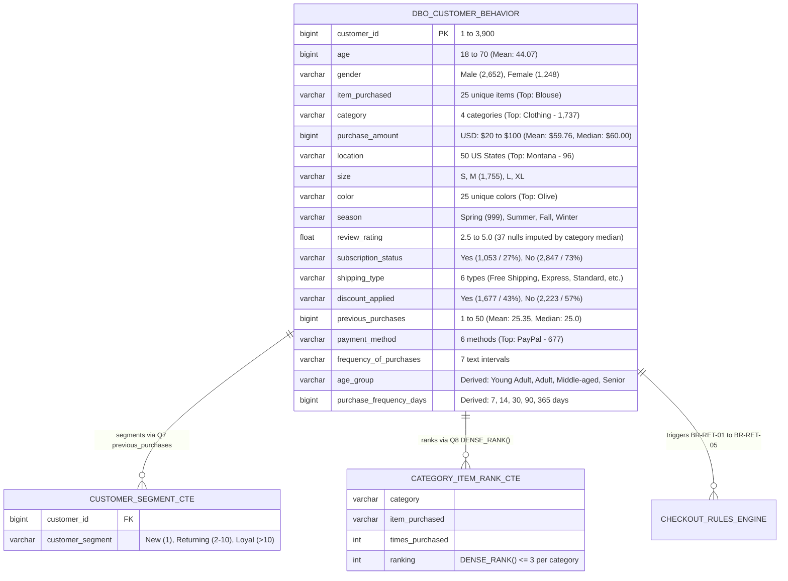

# Business Requirements Document (BRD): Minimum-Spend Promo Engine & Loyalty Optimization

<!-- **Document ID:** BRD-RET-2026-09   -->
<!-- **Author:** Nguyen Thu Thao   -->

**Role:** Technical Business Analyst / Growth Product Owner  
**Source Database:** MS SQL Server (`dbo.customer_behavior` — 3,900 Transactions in USD)  
**Status:** Case Study BRD (Backed by Historical Transaction Simulation)

---

## 1. Executive Summary & Business Case

Analysis of **3,900 retail customer transactions** across **50 US states** and **4 product categories** (`Clothing`, `Accessories`, `Footwear`, `Outerwear`) in MS SQL Server and Power BI uncovered two major revenue and retention leaks:

1. **Unrestricted Promo Margin Erosion (`Q2` & `Q6`):** Promotional codes (`discount_applied = 'Yes'`) are used on **43.0% of all orders (1,677 transactions)** without a minimum spend requirement. While storewide `purchase_amount` averages **$59.76 USD** (overall median **$60.00 USD**, range `$20–$100`), **50%** of discounted orders fall below the discounted cohort median of **$60 USD**.
2. **Repeat-Buyer Subscription Deficit (`Q5`, `Q7` & `Q9`):** Although the customer base exhibits strong repeat behavior (mean **25.35 `previous_purchases`**, median **25.0**), **73.0% of shoppers (2,847 users)** remain unsubscribed (`subscription_status = 'No'`), leaving recurring loyalty value untapped among `'Returning'` (`2–10` purchases) and `'Loyal'` (`> 10` purchases) segments.

### What-If Opportunity Sizing

Simulating a **Minimum-Spend Promo Threshold (`$60+ USD`)** paired with an in-cart upsell carousel shows that if a conservative **25%** of sub-median discount shoppers add items to reach `$60`, the platform captures **$4452.75 USD in incremental revenue** (a **4.5%** revenue lift across the discounted cohort).

---

## 2. Data Architecture & Schema Mapping (`dbo.customer_behavior`)

The promo and loyalty engine reads cleaned customer and transaction attributes ingested with `SQLAlchemy` + `ODBC Driver 18 for SQL Server`.

_Note on Schema Deduplication:_ During data preparation, `promo_code_used` was verified to be 100% identical to `discount_applied` across all 3,900 rows and dropped prior to SQL Server ingestion to maintain 3NF schema hygiene.

---

## 3. Project Scope & Stakeholder Alignment

| In-Scope (Phase 1 & 2 Release)                                                                                                                                                                                                                                                                                                                                                                                                                         | Out-of-Scope (Future Phases)                                                                                                                        |
| :----------------------------------------------------------------------------------------------------------------------------------------------------------------------------------------------------------------------------------------------------------------------------------------------------------------------------------------------------------------------------------------------------------------------------------------------------- | :-------------------------------------------------------------------------------------------------------------------------------------------------- |
| • Minimum-spend threshold validation (`purchase_amount >= $60`) when `discount_applied = 'Yes'`. • Dynamic Cart Upsell Progress Bar (`"Add $X more to unlock promo"`). • Add-on item recommendations powered by **Q8 Category Top-3** and **Q3 Top-5 Review Rating** SQL logic. • Checkout Loyalty Subscription opt-in prompt for repeat buyers (`previous_purchases >= 5`, **Q9**) selecting paid shipping (`Express` / `Standard`, **Q4**). | • Base catalog price changes across the 25 items. • Payment gateway fee renegotiation. • Physical store POS integration across the 50 states. |

---

## 4. Feature Prioritization (RICE Matrix)

Initiatives were scored using the **RICE framework** (**Reach × Impact × Confidence ÷ Effort**) anchored to actual record counts in `dbo.customer_behavior`:

| Initiative ID | Feature Name                                            | Target Cohort (`dbo.customer_behavior`)                                                                                       | Reach | Impact | Confidence | Effort (Wks) | **RICE Score** | Roadmap Phase             |
| :------------ | :------------------------------------------------------ | :---------------------------------------------------------------------------------------------------------------------------- | :---- | :----- | :--------- | :----------- | :------------- | :------------------------ |
| **INIT-01**   | **Minimum-Spend Promo Gate (`$60+`) & Upsell Carousel** | Discount users (`1,677` rows)                                                                                                 | 1,677 | 2.0    | 90%        | 2.0          | **1,509**      | **Phase 1 (Immediate)**   |
| **INIT-02**   | **Repeat-Buyer Loyalty & Express Shipping Opt-In**      | Repeat non-subscribers (`previous_purchases >= 5`, `Q9`)                                                                      | 2,500 | 1.5    | 80%        | 3.0          | **1,000**      | **Phase 2 (Next Sprint)** |
| **INIT-03**   | **Automated Cycle Replenishment Nudges**                | High-frequency shoppers (`purchase_frequency_days <= 30`: Weekly `539` + Fortnightly `542` + Bi-Weekly `547` + Monthly `553`) | 2,181 | 1.0    | 75%        | 3.0          | **545**        | **Phase 3 (Backlog)**     |

---

## 5. Business Rules Catalog (Mapped to SQL Queries Q1–Q10)

| Rule ID       | Rule Name                                                    | SQL / Business Logic Specification                                                                                                                                                                                         | Exception / Override Condition                                                                               |
| :------------ | :----------------------------------------------------------- | :------------------------------------------------------------------------------------------------------------------------------------------------------------------------------------------------------------------------- | :----------------------------------------------------------------------------------------------------------- |
| **BR-RET-01** | **Promo Minimum Basket Gate (`Q2`, `Q6`)**                   | A promotional code (`discount_applied = 'Yes'`) SHALL only deduct from the order total if `purchase_amount >= $60` (cohort median threshold).                                                                              | Waived for `'Loyal'` tier subscribers (`previous_purchases > 10` AND `subscription_status = 'Yes'`).         |
| **BR-RET-02** | **Dynamic Threshold Gap Calculation**                        | When `purchase_amount < $60` and a promo code is entered, the system SHALL compute `Threshold_Gap = $60 - purchase_amount` and render the Upsell Progress Bar.                                                             | If `Threshold_Gap <= 0`, immediately apply promo and display `"Discount Applied!"` badge.                    |
| **BR-RET-03** | **Category & Rating Upsell Feed (`Q3`, `Q8`)**               | The upsell carousel SHALL query **Q8** (`DENSE_RANK() <= 3` within the shopper's active `category`) and **Q3** (`avg_review_rating` top performers, `review_rating >= 3.80` median) to display 3 quick-add items.          | Filter out items matching the exact `item_purchased` already in the cart.                                    |
| **BR-RET-04** | **Repeat-Buyer Loyalty Conversion (`Q4`, `Q5`, `Q7`, `Q9`)** | If `subscription_status = 'No'` AND `previous_purchases >= 5` (`Returning` / `Loyal` segments) AND `shipping_type IN ('Express', 'Standard')`, display a one-click `"Subscribe for Instant Free Express Shipping"` toggle. | Suppress prompt if user dismissed it within the last 30 days.                                                |
| **BR-RET-05** | **Cycle-Timed Replenishment (`Q10`)**                        | Trigger automated email/SMS restock reminders at `Order_Date + purchase_frequency_days - 3 days` (`4d` for `Weekly`, `11d` for `Fortnightly/Bi-Weekly`, `27d` for `Monthly`), tailored by `age_group` top categories.      | Do not include promo codes in replenishment nudges for items in the **Q6 Top-5 `discount_usage_rate`** list. |

---

## 6. Use Case Specification: Sub-Median Promo Checkout & Upsell (`UC-01`)

- **Actor:** Online Retail Shopper (`Returning` or `Loyal` segment)
- **Preconditions:** Shopper has selected an item (e.g., `Category = 'Clothing'`, `purchase_amount = $45.00`) and enters a promo code at checkout.
- **Primary Flow (Happy Path — Upsell Conversion):**
  1. Shopper enters promo code and clicks **"Apply"**.
  2. System checks `BR-RET-01` (`purchase_amount` against `$60`).
  3. System detects `$45.00 <$60`, holds `discount_applied` in a `Pending` state, and displays: _"Add $(60 - 45.00) more to unlock your promotional discount!"_
  4. System executes `BR-RET-03`, querying the **Top 3 `Clothing` items (`Q8`)** with `review_rating >= 3.8` (`Q3`), and renders 3 one-click product cards below the progress bar.
  5. Shopper clicks **"+ Add"** on a recommended item, pushing `purchase_amount >= $60`.
  6. System sets `discount_applied = 'Yes'` and recalculates the checkout total.
- **Alternative Flow (Non-Subscriber Shipping Nudge — `BR-RET-04`):**
  - At Step 6, if the shopper has `previous_purchases >= 5`, `subscription_status = 'No'`, and selects `shipping_type = 'Express'`, the UI displays a one-click checkbox to enroll in the Loyalty Subscription (`subscription_status = 'Yes'`) and waive shipping fees.

---

## 7. Agile Acceptance Criteria & Power BI KPI Mapping

### User Story 1: Minimum-Spend Promo Gate (`INIT-01`)

- **As a** Merchandising & Growth Product Owner,
- **I want** promo codes to require a minimum basket of `$60 USD` and surface top-ranked category items (`Q8`) when a shopper's cart is below `$60`,
- **So that** we eliminate margin dilution on small orders and capture an estimated **$4452.75 USD** in incremental upsell revenue.
- **Acceptance Criteria (Given / When / Then):**
  - **Given** a checkout session where `purchase_amount < $60`,
  - **When** the user submits a valid promo code,
  - **Then** prevent discount deduction, display the `$Threshold_Gap` progress bar, and render 3 items from the user's `category` where `ranking <= 3` (`Q8`) and `review_rating >= 3.80`.

### User Story 2: Repeat-Buyer Subscription Conversion (`INIT-02`)

- **As a** Customer Retention Lead,
- **I want** non-subscribed repeat shoppers (`previous_purchases >= 5` and `subscription_status = 'No'`) who select `Standard` or `Express` shipping to receive an in-checkout subscription upgrade prompt,
- **So that** we increase subscription penetration above the current **27.0% (`1,053 / 3,900`)** baseline.

### Power BI Dashboard Tracking Mapping (`dashboard.pbix`)

| Metric Category         | KPI Name                                  | SQL / Power BI DAX Logic                                                                    | Business Objective                                                                     |
| :---------------------- | :---------------------------------------- | :------------------------------------------------------------------------------------------ | :------------------------------------------------------------------------------------- |
| **Primary Revenue KPI** | **Above-Average Promo Share (`Q2`)**      | `% of discount_applied = 'Yes' orders where purchase_amount > 59.76`                        | Shift the discounted order distribution above the storewide mean spend.                |
| **Product Margin KPI**  | **Top-5 Item Discount Reliance (`Q6`)**   | `SUM(CASE WHEN discount_applied = 'Yes' THEN 1 ELSE 0 END) * 100.0 / COUNT(*)`              | Reduce promo dependency on the Top 5 most-discounted catalog items.                    |
| **Loyalty Growth KPI**  | **Repeat-Buyer Subscription Rate (`Q9`)** | `COUNT(subscription_status = 'Yes') / COUNT(*)` for `previous_purchases >= 5`               | Convert `'Returning'` (`2–10`) and `'Loyal'` (`> 10`) cohorts (`Q7`) into subscribers. |
| **Demographic KPI**     | **Age Cohort Revenue Mix (`Q10`)**        | `SUM(purchase_amount) GROUP BY age_group` (`Middle-aged`, `Senior`, `Adult`, `Young Adult`) | Track revenue lift across age segments following cycle replenishment nudges.           |
